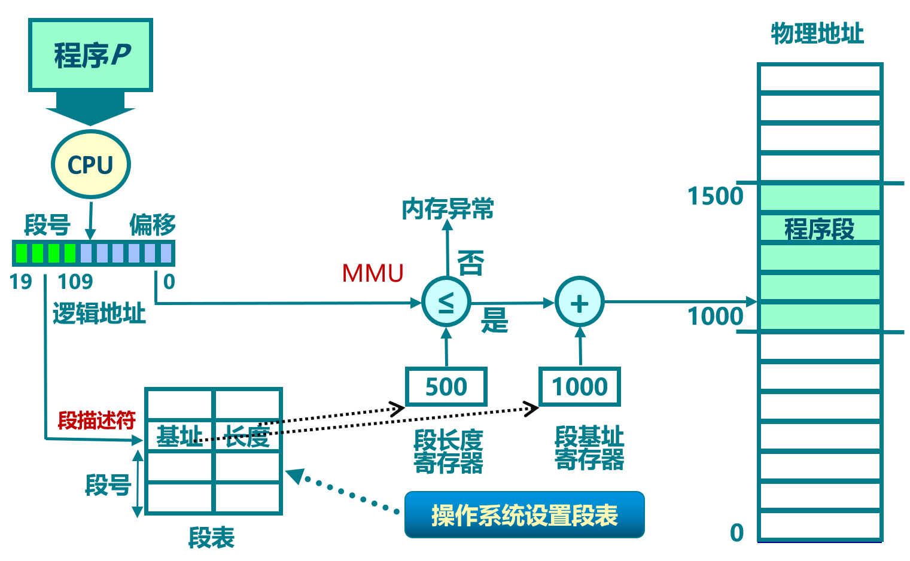
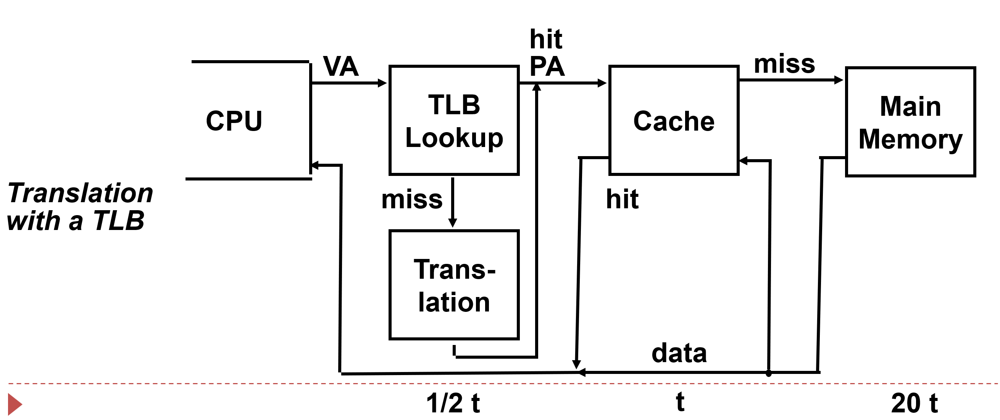

# 第五讲 物理内存管理

# 第二节 内存分配

---

# 1. 内存分配

内存分配是操作系统管理内存资源的重要环节，涉及多个技术和方法，以确保系统运行高效且稳定。

## 内存分配的基本概念

内存分配可以分为针对操作系统自身的分配和针对应用程序的分配。主要关注的是面向应用程序的内存分配。

### 静态内存分配

- **定义**：静态内存分配在编译时完成，分配的内存大小和位置在程序运行期间不会改变。
- **特点**：分配过程简单，效率高，适用于全局变量和静态变量。

### 动态内存分配

- **定义**：动态内存分配在程序运行时进行，内存的分配和释放由程序员控制。
- **特点**：灵活性高，适用于需要在运行时确定大小的数据结构，如堆（heap）。

## 连续内存分配与非连续内存分配

内存分配还可以根据分配方式的不同分为连续内存分配和非连续内存分配。

### 连续内存分配

- **定义**：内存分配在连续的地址空间中进行。
- **特点**：分配简单，内存地址连续，但容易产生内存碎片，且难以高效利用大块内存。

### 非连续内存分配

- **定义**：内存分配在不连续的地址空间中进行，通过页表等机制管理。
- **特点**：可以有效利用零散的内存块，减少内存碎片，但管理复杂度较高。

## 动态内存分配的技术

动态内存分配主要涉及栈（stack）和堆（heap）的管理。

### 栈的管理

- **特点**：栈的内存分配和释放由编译器自动管理，适用于局部变量和函数调用。
- **优点**：管理简单，效率高。
- **限制**：栈的大小在程序启动时固定，不能动态调整。

### 堆的管理

- **特点**：堆的内存分配和释放由程序员通过系统调用（如`malloc`和`free`）管理。
- **优点**：灵活性高，适用于需要动态调整大小的数据结构。
- **挑战**：需要程序员手动管理内存，容易产生内存泄漏和碎片。

## 内存分配的优化策略

为了提高内存使用效率和系统性能，操作系统采用多种优化策略进行内存分配。

### 内存分配算法

- **首次适配（First Fit）**：从头开始查找第一个足够大的空闲块进行分配。
- **最佳适配（Best Fit）**：查找所有空闲块中最小的一个足够大的块进行分配。
- **最差适配（Worst Fit）**：查找所有空闲块中最大的一个块进行分配，以保留大块空闲内存。

### 分区分配

- **固定分区**：将内存划分为若干固定大小的分区，每个分区只能分配给一个进程。
- **动态分区**：根据进程需要动态分配内存块，可以使用首次适配、最佳适配等算法。

### 内存回收

- **垃圾回收（Garbage Collection）**：自动回收不再使用的内存，减少内存泄漏，常用于高级语言的运行时环境。
- **引用计数（Reference Counting）**：通过计数来管理内存，当引用计数为零时释放内存。

## 内存分配的安全性与隔离

操作系统通过多种机制确保内存分配的安全性和进程间的隔离。

### 内存保护机制

- **页表**：记录虚拟地址到物理地址的映射关系，并包含访问权限信息。
- **访问权限控制**：根据内存区域的类型（如代码段、数据段）设置不同的访问权限，防止非法访问。

### 进程隔离

- **独立地址空间**：每个进程拥有独立的虚拟地址空间，防止进程间的内存干扰。
- **内核与用户空间隔离**：内核空间与用户空间隔离，防止用户程序访问内核数据。

## 动态内存分配的类型

在操作系统中，动态内存分配是一项重要的功能，分为显式内存分配和隐式内存分配。不同的编程语言和环境对内存分配的管理方式有所不同。

### 显式内存分配

显式内存分配由程序员控制内存的申请和释放，常见的函数如`malloc`和`free`。

#### 典型例子

- **C语言**：使用`malloc`申请内存，使用`free`释放内存。
- **内存管理**：程序员负责管理内存的生命周期，手动释放不再使用的内存。

#### 优缺点

- **优点**：高效，内存管理灵活，适用于性能要求高的应用。
- **缺点**：容易产生内存泄漏和内存释放错误，需要程序员小心管理。

### 隐式内存分配

隐式内存分配由运行时环境自动管理内存的申请和释放，不需要程序员显式地释放内存。

#### 典型例子

- **Java、Python、Go**：这些语言有垃圾回收机制（Garbage Collection），自动管理内存。
- **Rust**：Rust通过编译器在编译时确定内存的释放，不依赖运行时垃圾回收。

#### 优缺点

- **优点**：降低内存管理的复杂性，减少内存泄漏和释放错误的可能性。
- **缺点**：垃圾回收可能带来性能开销，Rust的编译器管理内存增加了编程复杂性。

## 动态内存分配的实现

动态内存分配可以是连续的或非连续的，操作系统通过系统调用支持这些分配方式。

### 栈和堆的增长方向

- **栈**：由高地址向低地址增长，自动管理，不需要程序员干预。
- **堆**：由低地址向高地址增长，由程序员控制，通过系统调用进行管理。

### 系统调用

- **`sbrk`**：一个简单的系统调用，用于调整数据段的大小，从而增加或减少堆空间。
- **`mmap`**：用于在堆空间中分配不连续的内存块，可以指定内存地址和大小。

## 内存分配函数的使用

动态内存分配函数如`malloc`和`free`是C语言中的标准函数，用于申请和释放内存。

### `malloc`函数

- **功能**：申请指定大小的内存块，并返回指向该内存块的指针。
- **使用方法**：`void* ptr = malloc(size_t size);`
- **优点**：简单易用，适用于大多数动态内存分配需求。

### `free`函数

- **功能**：释放由`malloc`申请的内存块，防止内存泄漏。
- **使用方法**：`free(void* ptr);`
- **注意事项**：必须保证每个`malloc`对应一个`free`，否则会导致内存泄漏或重复释放错误。

## 动态内存管理中的常见问题

动态内存管理需要仔细处理，否则容易出现内存泄漏、重复释放和内存碎片等问题。

### 内存泄漏

- **定义**：程序在运行过程中未释放已分配的内存，导致内存使用量逐渐增加。
- **原因**：未正确调用`free`函数释放内存。

### 重复释放

- **定义**：同一块内存被多次释放，可能导致程序崩溃。
- **原因**：逻辑错误或内存管理不当。

### 内存碎片

- **定义**：由于频繁的内存分配和释放，导致内存中出现许多小的未使用块，影响内存利用率。
- **解决方法**：使用内存池或内存整理技术减少碎片。

## 动态内存分配在大规模程序中的应用

在大规模程序中，动态内存管理的复杂性和重要性显著增加，需要更多的策略和工具支持。

### 静态分析工具

- **功能**：检查代码中的内存管理问题，如内存泄漏和未初始化内存使用。
- **工具**：Valgrind、AddressSanitizer等。

### 自动化测试

- **功能**：通过自动化测试检测动态内存分配和释放中的问题。
- **工具**：单元测试框架（如JUnit、pytest）和内存测试工具。

动态内存分配是操作系统和编程语言中的重要功能，通过显式和隐式内存管理方法，为程序提供灵活高效的内存使用方式。理解和正确应用这些技术，有助于提高程序的性能和稳定性，特别是在大规模复杂应用中。

---

# 2. 连续内存分配

## 2.1 动态分区分配

### 连续内存分配

在操作系统中，连续内存分配是一种常见的内存管理方式，旨在为应用程序提供一块连续的内存区域。以下是对连续内存分配的详细总结和扩展：

#### 连续内存分配的概念

连续内存分配指的是从一块连续的内存区域中为应用程序分配指定大小的内存。这种分配方式可以由操作系统内核管理，也可以由库（如C标准库）来管理。

#### 分配过程

- **`malloc`与`free`**：使用`malloc`函数为应用程序分配一块连续的内存，使用`free`函数释放这块内存。
- **管理方式**：可以由内核直接管理，或者通过库（如`glibc`）进行管理，以提高效率。

### 内碎片与外碎片

内存碎片是内存管理中的一个重要问题，主要分为内碎片和外碎片。

#### 内碎片

- **定义**：当分配的内存块比实际需要的大时，未使用的部分就成为内碎片。
- **例子**：如果申请了一块较大的内存区域，但只使用了其中的一小部分，未使用的部分就是内碎片。

#### 外碎片

- **定义**：内存中存在许多小的空闲块，但这些块由于不连续，无法满足较大内存块的分配需求。
- **例子**：多次分配和释放内存后，内存中可能会出现许多小的空闲块，这些空闲块虽然总量上足够大，但由于不连续，无法分配给需要大块内存的程序。

## 提高内存分配效率

为了提高内存分配的效率，需要解决以下几个关键问题：

### 空闲块的组织

- **链表**：使用链表将空闲块组织起来，方便快速查找和分配。
- **位图**：使用位图表示内存块的使用情况，每个位代表一个固定大小的内存块，0表示空闲，1表示已使用。

### 空闲块的选择

- **首次适配（First Fit）**：从头开始查找第一个足够大的空闲块进行分配。
- **最佳适配（Best Fit）**：查找所有空闲块中最小的一个足够大的块进行分配。
- **最差适配（Worst Fit）**：查找所有空闲块中最大的一个块进行分配，以保留大块空闲内存。

### 内存块的分割

- **分割策略**：当一个空闲块比实际需要的内存块大时，将其分割为两个部分，一部分分配给应用程序，另一部分作为新的空闲块。
- **碎片管理**：尽量减少分割后产生的碎片，提高内存利用率。

### 内存块的合并

- **合并策略**：当释放一个内存块时，如果其相邻的内存块也是空闲的，则将这些空闲块合并为一个更大的空闲块。
- **防止碎片**：通过合并相邻的空闲块，减少内存碎片，提高内存分配效率。

## 内存分配算法与策略

为了实现高效的内存分配，需要设计合理的内存分配算法和策略。

### 内存分配算法

- **首次适配算法（First Fit）**：从链表头开始查找第一个足够大的空闲块。
- **最佳适配算法（Best Fit）**：遍历所有空闲块，查找最小的一个足够大的块。
- **最差适配算法（Worst Fit）**：遍历所有空闲块，查找最大的一个块。

### 内存分配策略

- **空闲块管理**：使用链表或位图管理空闲块，方便快速查找和分配。
- **合并和分割**：在分配和释放内存时，合理进行内存块的合并和分割，提高内存利用率。
- **动态调整**：根据实际内存使用情况，动态调整内存分配策略，优化性能。

连续内存分配是操作系统内存管理中的一项重要技术，通过合理的分配和管理策略，可以提高内存利用率，减少内存碎片。理解和应用这些技术，有助于设计高效的内存管理方案，确保系统的稳定性和性能。

## 内存分配算法总结

内存分配算法在操作系统中起着至关重要的作用，它们决定了内存分配的效率和内存碎片的管理。常见的内存分配算法包括首次适配（First Fit）、最佳适配（Best Fit）和最差适配（Worst Fit）。这些算法各有优缺点，需要根据具体应用场景选择合适的算法。

### 首次适配（First Fit）

#### 概念

- **定义**：从链表头开始查找第一个足够大的空闲块进行分配。
- **过程**：依次检查空闲块列表，找到第一个能满足分配请求的块，然后进行分割和分配。

#### 优点

- **效率高**：查找过程简单，速度快。
- **实现容易**：算法逻辑简单，易于实现。

#### 缺点

- **外碎片多**：随着内存的分配和释放，空闲块会变得越来越小，导致外碎片问题严重。
- **内存利用率低**：容易产生大量无法利用的小碎片。

### 最佳适配（Best Fit）

#### 概念

- **定义**：查找所有空闲块中最小的一个足够大的块进行分配。
- **过程**：遍历所有空闲块，找到最接近需求大小的块，然后进行分割和分配。

#### 优点

- **减少内碎片**：通过选择最接近需求大小的块，减少了内存块内部的浪费。

#### 缺点

- **查找耗时**：需要遍历所有空闲块，查找过程较慢。
- **外碎片多**：虽然减少了内碎片，但可能产生更多的小块空闲块，增加了外碎片。

### 最差适配（Worst Fit）

#### 概念

- **定义**：查找所有空闲块中最大的块进行分配。
- **过程**：遍历所有空闲块，找到最大的块进行分割和分配。

#### 优点

- **减少外碎片**：通过优先使用大块内存，保留更多的中小块内存，减少了外碎片的产生。

#### 缺点

- **大块内存用完快**：大块内存优先被分配，可能导致大块内存很快被用完。
- **查找耗时**：需要遍历所有空闲块，查找过程较慢。

### 内存释放（Free）操作

内存释放操作是内存管理的重要环节，需要考虑释放后的内存合并问题，以提高内存利用率。

#### 内存合并

- **概念**：当释放一个内存块时，如果其相邻的内存块也是空闲的，则将这些空闲块合并为一个更大的空闲块。
- **优点**：通过合并相邻的空闲块，减少内存碎片，提高内存分配效率。
- **实现**：检查释放块的上下相邻块，如果它们也是空闲块，则合并这些块。

### 内存分配中的碎片问题

内存分配中的碎片问题是影响内存利用率的重要因素，主要分为内碎片和外碎片。

#### 内碎片

- **定义**：当分配的内存块比实际需要的大时，未使用的部分就成为内碎片。
- **解决方法**：通过最佳适配算法减少内碎片的产生。

#### 外碎片

- **定义**：内存中存在许多小的空闲块，但这些块由于不连续，无法满足较大内存块的分配需求。
- **解决方法**：通过最差适配算法和内存合并技术减少外碎片。

### 内存分配策略的选择

内存分配策略的选择需要综合考虑系统性能、内存利用率和应用需求。

#### 应用场景

- **首次适配**：适用于查找效率要求高的场景。
- **最佳适配**：适用于对内碎片敏感的场景。
- **最差适配**：适用于希望减少外碎片的场景。

#### 综合策略

- **混合使用**：在实际应用中，可以根据具体情况混合使用多种内存分配算法，以达到最佳的内存管理效果。

---

## 2.2 伙伴系统(Buddy System)

## 内存分配策略：减少外碎片

为了减少外碎片并提高内存利用率，操作系统和编程语言采取了一些限制和策略。例如，Java通过对内存分配的大小进行限制，以减少外碎片的产生。

### 固定大小的内存分配

通过限制内存分配的大小，使其符合特定的大小（例如2的幂次方），可以有效减少外碎片。

#### 固定大小块的好处

- **减少外碎片**：通过统一的分配大小，消除了许多不连续的小块空闲内存，从而减少外碎片。
- **快速分配和释放**：固定大小的块便于快速查找、分配和释放内存，提高了内存管理效率。
- **便于合并**：固定大小的块在释放时更容易合并，进一步减少碎片。

## 内存分配示例

假设内存块的最小单位是4KB，内存分配按照4KB、8KB、16KB等大小进行分配。

### 内存分配过程

- **申请内存**：当程序申请内存时，内存管理系统会根据申请大小选择合适的内存块。例如，申请大小为4KB，则分配一个4KB的内存块。
- **释放内存**：当程序释放内存时，内存管理系统会将内存块标记为可用，并尝试合并相邻的空闲块。

## 分配算法：伙伴系统（Buddy System）

伙伴系统是一种常用的内存分配算法，通过将内存块划分为固定大小的块，实现快速分配和合并。

### 伙伴系统的结构

- **内存块的划分**：将内存块划分为固定大小的块，例如4KB、8KB、16KB等。
- **块的组织**：使用二叉树或链表结构组织这些块，每个块都可以进一步划分或合并。

### 分配和释放过程

- **分配内存**：从最小的空闲块开始查找，直到找到合适大小的块。如果当前块太大，则将其拆分为两个伙伴块，继续查找。
- **释放内存**：将内存块标记为空闲，并尝试合并相邻的伙伴块，直到无法合并为止。

## 内存分配的效率

固定大小块和伙伴系统通过限制内存分配的大小，提高了内存分配的效率。

### 快速查找

- **固定大小块**：由于内存块大小固定，可以通过索引或二叉树快速查找合适的块。
- **伙伴系统**：通过二叉树结构，可以快速找到合适的块，并进行分割或合并。

### 减少碎片

- **外碎片减少**：固定大小块和伙伴系统有效减少了外碎片，提高了内存利用率。
- **内碎片**：虽然固定大小块可能会产生内碎片，但整体效率较高，适用于大多数应用场景。

## 示例：伙伴系统

假设内存总大小为16KB，最小块大小为4KB。以下是内存分配和释放的示例：

### 初始状态

- 内存划分为16KB的一个大块。

### 分配过程

1. **申请4KB内存**：将16KB块分为两个8KB块，继续分割其中一个8KB块为两个4KB块，分配一个4KB块。
2. **申请8KB内存**：分配剩下的一个8KB块。

### 释放过程

1. **释放4KB内存**：将4KB块标记为空闲，尝试合并相邻的伙伴块。
2. **释放8KB内存**：将8KB块标记为空闲，继续尝试合并相邻的伙伴块。

通过固定大小块和伙伴系统等策略，内存分配算法可以有效减少外碎片，提高内存利用率和分配效率。这些技术在实际操作系统和编程语言中得到广泛应用，确保内存管理的高效性和稳定性。理解这些算法的工作原理和应用场景，有助于设计和实现高效的内存管理方案。

## +连续内存分配中的伙伴系统

连续内存分配中的伙伴系统（Buddy System）是一种常用的内存分配算法，通过将内存块划分为固定大小的块，实现快速分配和合并，减少内存碎片。以下是对伙伴系统的详细总结和扩展：

### 伙伴系统的数据结构

伙伴系统利用数组和链表结构来组织空闲内存块，实现高效的内存分配和释放。

#### 数据结构

- **二维数组或链表**：用于组织空闲块，不同大小的块分别存储在不同的链表中。
- **空闲块列表**：每个链表存储相同大小的空闲块，通过链表可以快速查找和分配。

### 伙伴系统的分配过程

伙伴系统按照从小到大的顺序查找最小的可用块，如果空闲块过大，则进行切分，将其分割成更小的块。

#### 分配示例

1. **初始化**：假设初始内存大小为1MB。
2. **分配请求**：如果请求分配100KB（或128KB），系统将1MB块分为两个512KB块，再将512KB块分为两个256KB块，最终将256KB块分为两个128KB块，分配其中一个128KB块。
3. **进一步分配**：如果再请求分配240KB，系统将查找满足240KB的块，如果没有合适的块，则继续分割更大的块，直到找到合适的块。

### 内存释放与合并

释放内存块时，需要检查相邻的块是否也是空闲的，如果是，则将它们合并为更大的块。

#### 合并示例

1. **释放128KB块**：释放时，检查相邻的128KB块是否也是空闲的，如果是，则将两个128KB块合并为一个256KB块。
2. **进一步合并**：如果再释放一个256KB块，则检查相邻的256KB块是否也是空闲的，如果是，则将它们合并为一个512KB块。

### 伙伴系统的优势

伙伴系统通过固定大小块和高效的分配与合并策略，减少了内存碎片，提高了内存利用率。

#### 优势

- **减少外碎片**：通过固定大小块，减少了不连续的小块空闲内存，从而减少外碎片。
- **快速分配和释放**：利用链表和数组结构，可以快速查找、分配和释放内存块。
- **便于合并**：固定大小块在释放时更容易合并，进一步减少碎片。

### 伙伴系统的缺点

尽管伙伴系统有许多优点，但也存在一些缺点，特别是内碎片问题。

#### 缺点

- **内碎片**：由于固定大小块的限制，分配的块可能比实际需要的大，导致内碎片。
- **合并复杂性**：合并过程需要检查相邻块是否也是空闲的，增加了复杂性。

### 伙伴系统在操作系统中的应用

伙伴系统广泛应用于实际操作系统，如Linux和Windows，以实现高效的内存管理。

#### Linux内核中的伙伴系统

- **内存管理**：Linux内核利用伙伴系统管理内存块，实现快速的内存分配和释放。
- **灵活性**：Linux内核的伙伴系统支持多种内存块大小，满足不同应用的需求。

### 高效内存分配算法：Slab分配器

除了伙伴系统，另一个常用的高效内存分配算法是Slab分配器，特别适用于小块内存的分配。

#### Slab分配器

- **定义**：Slab分配器是一种针对小块内存的高效分配算法，广泛应用于操作系统和应用程序中。
- **优点**：减少内碎片，提高内存利用率，特别适用于频繁分配和释放的小块内存。

---

# 3. 非连续内存分配

## 3.1 非连续内存分配的概念 

？

？

？

## 段式和页式内存管理

在操作系统中，内存管理的策略有多种，其中段式（Segmentation）和页式（Paging）内存管理是两种常见的方式。以下是对这两种内存管理方式的详细总结和扩展。

### 段式内存管理

段式内存管理是一种将内存划分为不同段的方式，每个段对应程序中的不同部分，如代码段、数据段等。

#### 段式内存管理的基本概念

- **段**：内存分为多个段，每个段包含一类数据，如代码段、数据段、堆栈段等。
- **段表**：操作系统使用段表（Segment Table）来记录每个段的基址和长度信息。

#### 段表结构

- **基址（Base Address）**：段的起始地址。
- **长度（Limit）**：段的长度。
- **访问控制信息**：权限检查，用于判断访问是否合法。

#### 段式内存管理的工作流程

1. **地址转换**：逻辑地址由段号和段内偏移组成。通过段号在段表中查找段的基址，再加上段内偏移得到物理地址。
2. **权限检查**：在访问内存时，硬件检查访问是否超出段的长度，并进行相应的权限检查。



#### 操作系统的职责

- **段表管理**：操作系统负责创建和维护段表，并在任务切换时加载正确的段表。
- **内存分配**：操作系统根据程序的需求分配段，并在段表中记录段的信息。

#### 优缺点

- **优点**：段式管理可以实现内存的逻辑分段，便于程序的模块化和保护。
- **缺点**：可能会导致外部碎片问题，内存分配和管理复杂。

### 页式内存管理

页式内存管理是一种将内存划分为固定大小的页的方式，每个页独立管理。

#### 页式内存管理的基本概念

- **页框（Page Frame）**：物理内存划分为固定大小的块，称为页框。
- **页（Page）**：虚拟内存也划分为相同大小的块，称为页。
- **页表（Page Table）**：操作系统使用页表记录每个虚拟页到物理页框的映射关系。

#### 页表结构

- **页号（Page Number）**：虚拟地址的高位部分，作为页表的索引。
- **页内偏移（Page Offset）**：虚拟地址的低位部分，表示页内的具体地址。

#### 页式内存管理的工作流程

1. **地址转换**：虚拟地址由页号和页内偏移组成。通过页号在页表中查找对应的页框号，再加上页内偏移得到物理地址。
2. **权限检查**：页表中包含访问权限信息，硬件在地址转换时进行权限检查。

#### 操作系统的职责

- **页表管理**：操作系统负责创建和维护页表，并在任务切换时加载正确的页表。
- **内存分配**：操作系统根据程序的需求分配页，并在页表中记录页的映射关系。

#### 优缺点

- **优点**：页式管理可以有效解决外部碎片问题，内存分配灵活。
- **缺点**：页表较大，可能导致页表管理的开销。

### 页表查找与内存管理单元（MMU）

#### 页表查找

- **页表查找过程**：通过页号在页表中查找对应的页框号，将虚拟地址转换为物理地址。
- **硬件支持**：内存管理单元（MMU）负责实现页表查找和地址转换，操作系统提供页表内容。

#### 快表（TLB）

- **快表**：为了加速页表查找，使用转换后备缓冲（TLB）缓存最近的页表项。
- **TLB命中**：如果TLB中有对应的页表项，直接使用，减少查找时间。
- **TLB未命中**：如果TLB中没有对应的页表项，查找页表并更新TLB。

### 段页式内存管理

段页式内存管理结合了段式和页式管理的优点，将内存划分为段，每个段再划分为页。

#### 段页式管理的结构

- **段表**：记录每个段的基址和长度。
- **页表**：每个段有一个页表，记录该段内每个页的映射关系。

#### 段页式管理的优缺点

- **优点**：结合了段式和页式管理的优点，实现内存的逻辑分段和灵活分配。
- **缺点**：管理复杂度较高，页表和段表的维护开销大。

段式和页式内存管理是操作系统中两种重要的内存管理方式，各有优缺点。段页式管理结合了两者的优点，实现了更加灵活和高效的内存管理。理解这些内存管理方式的工作原理和应用场景，有助于深入掌握操作系统的内存管理机制。


## 页表性能问题与解决方案

页表（Page Table）是操作系统中管理虚拟内存的重要数据结构，它的性能和容量对系统性能有直接影响。以下是对页表性能问题及其解决方案的详细总结和扩展。

### 页表性能问题

#### 性能瓶颈

1. **内存访问延迟**：由于页表位于内存中，访问页表需要额外的内存读取操作，这会导致性能下降。
2. **页表容量大**：在64位机器上，如果每页大小为4KB，单级页表的容量会非常大，存储所有的页表项需要大量内存空间。

#### 容量计算示例

- **64位地址空间**：假设每页大小为4KB（2^12字节），页表项大小为8字节（64位）。
- **单级页表**：需要2^52个页表项（2^64 / 2^12），即需要2^52 * 8字节 ≈ 36PB的内存来存储单级页表。

### 性能提升方法

#### 多级页表

为了减少单级页表的巨大内存需求，多级页表通过分级存储页表项，有效地减少了内存开销。

1. **多级页表结构**：通过分级存储页表项，每一级页表指向下一层的页表，从而减少了不必要的页表项存储。
2. **示例**：
   - **二级页表**：使用两级页表，第一级页表指向第二级页表。
   - **三级页表**：进一步分级，第一级页表指向第二级页表，第二级页表指向第三级页表。

#### 多级页表的优缺点

- **优点**：通过按需创建页表，减少了不必要的内存消耗，支持更大的虚拟地址空间。
- **缺点**：多级页表增加了地址转换的复杂度，每次地址转换需要多次内存访问，导致性能下降。

#### TLB（Translation Lookaside Buffer）

为了缓解多级页表带来的性能问题，使用TLB（转换后备缓冲）来缓存最近使用的页表项。

1. **TLB的作用**：TLB是一个小型的、高速缓存，用于存储最近使用的页表项，减少频繁的内存访问。
2. **TLB命中和未命中**：
   - **命中**：如果TLB中存在所需的页表项，则直接使用，无需访问内存。
   - **未命中**：如果TLB中不存在所需的页表项，则需要访问内存中的页表，更新TLB。



#### 数据缓存（Cache）

除了TLB，数据缓存（Cache）用于缓存最近访问的数据，进一步提高内存访问的效率。

1. **数据缓存的作用**：缓存最近访问的数据，减少对内存的直接访问。
2. **层级缓存**：
   - **一级缓存（L1 Cache）**：速度最快，容量最小。
   - **二级缓存（L2 Cache）**：速度和容量介于一级缓存和内存之间。
   - **三级缓存（L3 Cache）**：速度较慢，容量较大。

### 操作系统的职责

操作系统需要负责页表和TLB之间的数据一致性，以及多级页表的管理。

#### 数据一致性

1. **一致性维护**：确保页表和TLB中的数据一致，如果页表更新，需要同步更新TLB。
2. **页表更新**：操作系统在页表更新时，必须使相关的TLB条目失效，确保数据一致性。

#### 多级页表管理

1. **页表初始化**：操作系统在进程创建时初始化页表，并在任务切换时加载正确的页表。
2. **页表分配和回收**：根据进程的内存需求，动态分配和回收页表项，优化内存使用。


### 解决方案总结

为了提升页表的性能和减少内存开销，操作系统采用多级页表和TLB缓存等技术。

1. **多级页表**：通过分级存储页表项，减少了不必要的内存消耗，但增加了地址转换的复杂度。
2. **TLB缓存**：通过缓存最近使用的页表项，减少了内存访问，提高了地址转换的速度。
3. **数据缓存**：通过层级缓存结构，进一步提升内存访问效率，减少了CPU对内存的直接访问。

页表性能问题是操作系统内存管理中的重要挑战，通过多级页表和TLB缓存等技术，可以有效提升页表性能和内存利用率。理解这些技术的工作原理和应用场景，有助于设计和实现高效的内存管理方案。

## 反置页表（Inverted Page Table）

反置页表是一种解决页表容量问题的少见方式，它通过反转查找顺序来减少页表的大小。以下是对反置页表的详细总结和扩展：

### 反置页表的基本概念

传统页表使用虚拟页号作为索引，查找物理地址。然而，反置页表则是使用物理页号作为索引，查找虚拟地址。

#### 反置页表的工作原理

- **物理页号作为索引**：反置页表将物理页号作为索引，查找虚拟页号及相关信息。
- **哈希机制**：通过哈希机制将虚拟地址和进程ID映射到物理地址。

### 反置页表的查找过程

#### 地址转换

1. **虚拟地址和进程ID哈希**：将虚拟地址和进程ID进行哈希计算，得到一个哈希值。
2. **查找反置页表**：使用哈希值作为索引，查找反置页表中的条目。
3. **验证虚拟地址**：如果找到的条目中的虚拟地址和进程ID与原始请求一致，则查找成功。
4. **组合物理地址**：将物理页号与页内偏移组合，得到物理地址。

### 反置页表的优势

反置页表相对于传统页表有一些明显的优势：

1. **减少页表大小**：反置页表的大小与物理内存大小相关，而不是虚拟地址空间的大小。
2. **提高内存利用率**：通过哈希机制和链表解决冲突，可以高效地管理内存。

### 反置页表的挑战

尽管反置页表有其优势，但也面临一些挑战：

1. **哈希冲突**：由于哈希函数的限制，不同的虚拟地址可能映射到相同的哈希值，需要处理冲突。
2. **查找复杂性**：反置页表查找涉及哈希计算和冲突处理，增加了查找的复杂性。

### 反置页表的查找与冲突处理

#### 查找过程示例

1. **初始查找**：将虚拟地址和进程ID进行哈希计算，得到索引。
2. **索引查找**：使用哈希值作为索引，查找反置页表条目。
3. **条目验证**：检查条目中的虚拟地址和进程ID是否匹配，如果匹配，则查找成功。
4. **物理地址生成**：将物理页号与页内偏移组合，生成物理地址。


#### 冲突处理

1. **链表解决冲突**：如果哈希冲突（多个虚拟地址映射到相同哈希值），使用链表存储冲突条目。
2. **链表查找**：在冲突链表中查找匹配的虚拟地址和进程ID，找到后生成物理地址。

### 实例：PowerPC中的反置页表

反置页表在一些特定的架构中得到了应用，例如IBM的PowerPC 64位处理器。

#### PowerPC中的实现

1. **反置页表结构**：PowerPC使用反置页表来管理虚拟到物理地址的映射。
2. **性能优化**：通过硬件支持和优化的哈希函数，提高查找和冲突处理的效率。

### 性能优化

为了提高反置页表的性能，通常会采用一些优化技术：

1. **硬件哈希支持**：利用硬件加速哈希计算，提高查找速度。
2. **缓存机制**：使用TLB（转换后备缓冲）缓存最近使用的页表项，减少内存访问。
3. **优化哈希函数**：选择高效的哈希函数，减少冲突，提高查找效率。

反置页表是一种通过反转页表查找顺序来减少页表大小的技术，具有减少页表容量、提高内存利用率的优点，但也面临哈希冲突和查找复杂性的挑战。理解反置页表的工作原理和应用场景，有助于掌握操作系统中不同内存管理策略的优缺点和实现方法。

## 段式和页式内存管理的总结

在操作系统中，段式（Segmentation）和页式（Paging）内存管理各有特点和应用场景。以下是对段式和页式内存管理的总结及其在实际操作系统中的应用。

### 段式内存管理

段式内存管理将内存划分为逻辑上的段，每个段表示程序中的不同部分，如代码段、数据段等。

#### 特点

- **逻辑分段**：内存根据程序逻辑分为多个段，如代码段、数据段、堆栈段等。
- **段表管理**：段表记录每个段的基址和长度信息，用于地址转换和权限检查。

#### 优点

- **模块化**：段式管理便于程序的模块化和数据保护。
- **灵活性**：不同段可以有不同的权限和属性。

#### 缺点

- **外部碎片**：内存分配容易产生外部碎片，影响内存利用率。
- **复杂性**：段表的管理和维护较为复杂。

### 页式内存管理

页式内存管理将内存划分为固定大小的页，所有页大小相同，便于管理。

#### 特点

- **固定大小页**：内存和虚拟地址空间都划分为固定大小的页（Page）。
- **页表管理**：页表记录虚拟页到物理页的映射关系，用于地址转换。

#### 优点

- **减少外部碎片**：固定大小的页减少了内存中的外部碎片。
- **简单管理**：页表管理相对简单，适用于大多数操作系统。

#### 缺点

- **页表大小**：对于大地址空间，页表可能非常大，占用大量内存。
- **内存访问延迟**：页表查找需要多次内存访问，增加了内存访问延迟。

### 段页式内存管理

段页式内存管理结合了段式和页式的优点，内存划分为段，每个段再划分为页。

#### 特点

- **段页结合**：内存先划分为段，每个段再划分为页，段表和页表共同管理内存。
- **灵活管理**：既有段的逻辑分段优点，又有页的固定大小管理优势。

#### 优点

- **灵活性**：段页式管理结合了段式和页式的优点，提供更灵活的内存管理。
- **模块化和减少碎片**：既能实现模块化管理，又能减少外部碎片。

#### 缺点

- **复杂性**：管理和维护段表和页表的复杂性较高。

### 例子：malloc函数的内存分配过程

以C语言中的`malloc`函数为例，解释内存分配过程。

#### 内存分配过程

1. **程序加载**：操作系统将程序加载到内存中，分配堆区域用于动态内存分配。
2. **调用malloc**：程序调用`malloc`函数请求分配内存。
3. **libc库处理**：`malloc`函数由C标准库（libc）实现，libc库管理堆内存的分配和释放。
4. **堆内存管理**：libc库在堆区域中查找空闲块，如果找到合适的块，则直接分配。
5. **系统调用**：如果堆中没有足够的空闲块，libc库通过系统调用（如`sbrk`）请求操作系统分配新的内存区域。
6. **内存分配完成**：操作系统分配新的内存区域后，libc库将新的内存块合并到堆中，满足`malloc`请求。

#### 代码示例

```c
#include <stdlib.h>

int main() {
    // 调用malloc函数请求分配内存
    int* ptr = (int*)malloc(10 * sizeof(int));
    
    // 检查内存分配是否成功
    if (ptr == NULL) {
        // 内存分配失败，处理错误
        return -1;
    }
    
    // 使用分配的内存
    for (int i = 0; i < 10; i++) {
        ptr[i] = i;
    }
    
    // 释放分配的内存
    free(ptr);
    
    return 0;
}
```

段式和页式内存管理各有优缺点，页式管理由于减少外部碎片和管理简单性，在现代操作系统中应用广泛。然而，段页式管理结合了两者的优点，提供了更加灵活和高效的内存管理方式。理解这些内存管理技术和实际应用，有助于深入掌握操作系统的内存管理机制和提高程序设计的效率和性能。
